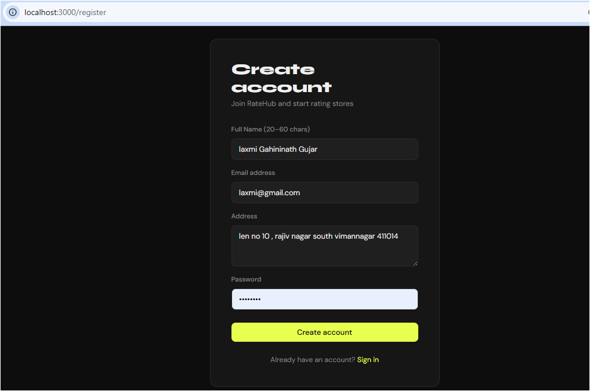

# RateHub — Store Rating Platform

A full-stack web app for submitting and managing store ratings, with role-based access for admins, normal users, and store owners.

## Tech Stack

- **Backend**: Express.js + Sequelize ORM
- **Database**: PostgreSQL
- **Frontend**: React (CRA) + React Router v6

---

## Getting Started

### 1. Database setup

Create a PostgreSQL database:

```sql
CREATE DATABASE store_rating_db;
```

### 2. Backend setup

```bash
cd backend
npm install
cp .env.example .env
# Edit .env with your DB credentials and a JWT secret
node src/seed.js   # Creates the default admin account
npm run dev
```

Backend runs on `http://localhost:5000`

### 3. Frontend setup

```bash
cd frontend
npm install
npm start
```

Frontend runs on `http://localhost:3000`

---

## Default Admin Credentials

```
Email:    admin@ratehub.com
Password: Admin@1234
```

---

## User Roles & Access

| Role        | Can Do |
|-------------|--------|
| Admin       | Dashboard stats, manage users & stores, view all details |
| Normal User | Browse/search stores, submit & update ratings, change password |
| Store Owner | View ratings for their store, see average rating, change password |

---

## Screenshots

Screenshots are stored in the `docs/` folder. Paste or move your image files there and reference them from the README.

Current screenshot files in `docs/`:
- `docs/p1.PNG`
- `docs/p2.PNG`
- `docs/p3.PNG`
- `docs/p4.PNG`
- `docs/p5.PNG`
- `docs/p6.PNG`
- `docs/p7.PNG`
- `docs/p8.PNG`
- `docs/p9.PNG`
- `docs/p10.PNG`
- `docs/p11.PNG`
- `docs/p12.PNG`

Add images with Markdown like this:

```md

```

> You can rename these files later for better clarity, such as `docs/login.png` or `docs/admin-dashboard.png`.

---

## Validation Rules

| Field    | Rule |
|----------|------|
| Name     | 20–60 characters |
| Email    | Standard email format |
| Address  | Max 400 characters |
| Password | 8–16 chars, at least one uppercase letter, at least one special character |

---

## API Endpoints

### Auth
| Method | Path | Description |
|--------|------|-------------|
| POST | `/api/auth/register` | Register a new user |
| POST | `/api/auth/login` | Login |
| PATCH | `/api/auth/update-password` | Change password (authenticated) |
| GET | `/api/auth/me` | Get current user |

### Admin (requires admin role)
| Method | Path | Description |
|--------|------|-------------|
| GET | `/api/admin/stats` | Dashboard statistics |
| GET | `/api/admin/users` | List users (filterable, sortable) |
| GET | `/api/admin/users/:id` | User detail |
| POST | `/api/admin/users` | Create user |
| GET | `/api/admin/stores` | List stores (filterable, sortable) |
| POST | `/api/admin/stores` | Create store |

### Stores
| Method | Path | Description |
|--------|------|-------------|
| GET | `/api/stores` | All stores with user's rating (user role) |
| POST | `/api/stores/rate` | Submit/update a rating (user role) |
| GET | `/api/stores/my-store` | Owner's store ratings (store_owner role) |

---

## Project Structure

```
store-rating-app/
├── backend/
│   └── src/
│       ├── config/       # Database connection
│       ├── controllers/  # Business logic
│       ├── middleware/    # Auth & role guards
│       ├── models/       # Sequelize models
│       ├── routes/       # Express routes
│       ├── index.js      # App entry point
│       └── seed.js       # Admin seeder
└── frontend/
    └── src/
        ├── components/   # Layout, ProtectedRoute, StarRating
        ├── context/      # Auth context
        ├── pages/        # All page components
        └── utils/        # Axios instance
```
